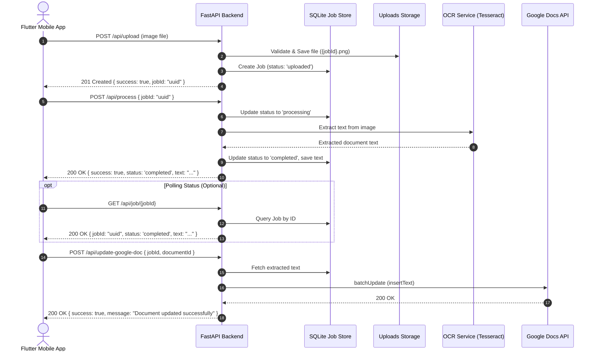

# CaptureBackend - FastAPI OCR & Google Docs Backend

A production-ready FastAPI backend in Python designed for the **Flutter OCR Document App**. It handles document image uploads, performs OCR text extraction via Tesseract, tracks asynchronous processing jobs with SQLite/SQLAlchemy persistence, and syncs extracted text directly to Google Documents.

---

## 🏗️ Architecture & Core Flow

```text
Flutter Mobile App
       ↓
POST /api/upload (Multipart image)
       ↓
Local Secure Storage (uploads/) + SQLite Job Store
       ↓
POST /api/process (Triggers OCR extraction)
       ↓
OCR Service (pytesseract / PIL image preprocessing)
       ↓
Extracted Document Text
       ↓
POST /api/update-google-doc (Appends text to Google Docs)
       ↓
Google Docs API v1
```

### Flow Diagram



---

## 📁 Project Structure

```text
CaptureBackend/
│
├── app/
│   ├── main.py                     # FastAPI application setup, CORS, lifespan, exception handlers
│   │
│   ├── api/
│   │   ├── deps.py                 # FastAPI dependency injection (DB session, services)
│   │   └── routes/
│   │       ├── __init__.py         # Aggregates /api router
│   │       ├── upload.py           # POST /api/upload
│   │       ├── process.py          # POST /api/process
│   │       ├── jobs.py             # GET /api/job/{id}
│   │       └── google_docs.py      # POST /api/update-google-doc
│   │
│   ├── core/
│   │   ├── config.py               # Pydantic Settings & environment variables
│   │   ├── database.py             # SQLAlchemy database engine, sessionmaker, init_db
│   │   └── errors.py               # Custom exceptions & uniform JSON error handlers
│   │
│   ├── models/
│   │   └── job.py                  # SQLAlchemy Job model (UUID, status, text, timestamps)
│   │
│   ├── schemas/
│   │   ├── common.py               # Standard error and detail models
│   │   ├── upload.py               # Upload response schemas
│   │   ├── process.py              # OCR process request and response schemas
│   │   ├── job.py                  # Job status query schemas
│   │   └── google_docs.py          # Google Docs update schemas
│   │
│   └── services/
│       ├── storage_service.py      # File validation, size limits, and UUID path storage
│       ├── ocr_service.py          # OCR service abstraction (pytesseract & background thread execution)
│       └── google_docs_service.py  # Google Docs API v1 client & error handling
│
├── tests/
│   ├── conftest.py                 # Test fixtures, TestClient, test SQLite database, mocks
│   ├── test_upload.py              # Upload validation and success tests
│   ├── test_process.py             # OCR processing & error tests
│   ├── test_jobs.py                # Job status lifecycle tests
│   └── test_google_docs.py         # Google Docs update & authorization tests
│
├── uploads/                        # Local image storage (.gitkeep)
├── requirements.txt                # Python dependencies
├── .env.example                    # Example configuration
├── .gitignore                      # Git ignore rules
└── README.md                       # Documentation
```

---

## ⚙️ Installation & Virtual Environment Setup

### 1. Prerequisites
- Python 3.10+
- (Optional for live OCR) Tesseract OCR engine:
  - **macOS**: `brew install tesseract`
  - **Ubuntu / Debian**: `sudo apt-get install tesseract-ocr`
  - **Windows**: Install via UB-Mannheim installer and add to PATH.

### 2. Create and Activate Virtual Environment
```bash
# Clone or navigate to the project directory
cd /Users/cv/Documents/CaptureBackend

# Create virtual environment
python3 -m venv venv

# Activate virtual environment
# macOS / Linux:
source venv/bin/activate
# Windows:
venv\Scripts\activate
```

### 3. Install Dependencies
```bash
pip install -r requirements.txt
```

---

## 🔑 Configuration & Environment Variables

Copy `.env.example` to `.env`:

```bash
cp .env.example .env
```

| Variable | Default | Description |
| :--- | :--- | :--- |
| `APP_ENV` | `development` | Environment mode (`development`, `production`, `test`) |
| `DEBUG` | `True` | Debug mode |
| `HOST` | `0.0.0.0` | Bind host address |
| `PORT` | `8000` | Bind port |
| `UPLOAD_DIR` | `uploads` | Directory to store uploaded image files |
| `MAX_FILE_SIZE_MB` | `10` | Maximum upload size per image in megabytes |
| `DATABASE_URL` | `sqlite:///./jobs.db` | SQLAlchemy database URL (SQLite by default, or PostgreSQL) |
| `SUPABASE_URL` | `""` | Supabase project URL (`https://<project-ref>.supabase.co`) |
| `SUPABASE_KEY` | `""` | Supabase anon/publishable API key |
| `OCR_ENGINE` | `tesseract` | OCR engine: `tesseract` or `mock` |
| `TESSERACT_CMD` | `""` | Custom path to `tesseract` binary (if not in system PATH) |
| `GOOGLE_APPLICATION_CREDENTIALS` | `""` | Path to Google Cloud Service Account JSON key file |

---

## 🚀 Running the Server

Start the FastAPI application with auto-reload:

```bash
uvicorn app.main:app --reload --host 0.0.0.0 --port 8000
```

The interactive documentation will be available at:
- **Interactive Swagger UI**: [http://127.0.0.1:8000/docs](http://127.0.0.1:8000/docs)
- **ReDoc UI**: [http://127.0.0.1:8000/redoc](http://127.0.0.1:8000/redoc)
- **Health Check**: [http://127.0.0.1:8000/health](http://127.0.0.1:8000/health)

---

## 📡 API Endpoints

### 1. Upload Image
`POST /api/upload` (multipart/form-data)

**Request:**
- `file`: Image file (`.jpg`, `.jpeg`, `.png`, `.webp`)

**Response (`201 Created`):**
```json
{
  "success": true,
  "jobId": "b1b7bf28-7690-4c48-8da2-9b2f150fefaa",
  "message": "Image uploaded successfully"
}
```

---

### 2. Process Document (OCR)
`POST /api/process` (application/json)

**Request:**
```json
{
  "jobId": "b1b7bf28-7690-4c48-8da2-9b2f150fefaa"
}
```

**Response (`200 OK`):**
```json
{
  "success": true,
  "jobId": "b1b7bf28-7690-4c48-8da2-9b2f150fefaa",
  "status": "completed",
  "text": "INVOICE #1024\nDate: 2026-08-15\nTotal: $150.00"
}
```

---

### 3. Get Job Status
`GET /api/job/{jobId}`

**Response (`200 OK`):**
```json
{
  "jobId": "b1b7bf28-7690-4c48-8da2-9b2f150fefaa",
  "status": "completed",
  "text": "INVOICE #1024\nDate: 2026-08-15\nTotal: $150.00"
}
```

---

### 4. Update Google Document
`POST /api/update-google-doc` (application/json)

**Request:**
```json
{
  "jobId": "b1b7bf28-7690-4c48-8da2-9b2f150fefaa",
  "documentId": "195P9TGajq50RnYWSmNV5004LJU50wb2Mg1IUR4WvTk4"
}
```

**Response (`200 OK`):**
```json
{
  "success": true,
  "jobId": "b1b7bf28-7690-4c48-8da2-9b2f150fefaa",
  "documentId": "195P9TGajq50RnYWSmNV5004LJU50wb2Mg1IUR4WvTk4",
  "message": "Document updated successfully"
}
```

---

### Standard Error Response Format
All error responses adhere to a consistent JSON format:
```json
{
  "success": false,
  "error": {
    "code": "JOB_NOT_FOUND",
    "message": "Processing job 'b1b7bf28-...' was not found"
  }
}
```

| HTTP Status | Error Code | Description |
| :--- | :--- | :--- |
| `400 Bad Request` | `JOB_NOT_READY` / `BAD_REQUEST` | Missing extracted text or invalid request |
| `404 Not Found` | `JOB_NOT_FOUND` / `IMAGE_NOT_FOUND` / `DOCUMENT_NOT_FOUND` | Resource not found |
| `413 Payload Too Large` | `FILE_TOO_LARGE` | Upload exceeds `MAX_FILE_SIZE_MB` limit |
| `422 Unprocessable` | `INVALID_FILE_TYPE` / `VALIDATION_ERROR` | Unsupported image extension or payload error |
| `500 Server Error` | `OCR_PROCESSING_ERROR` / `GOOGLE_API_ERROR` | OCR or Google Docs upstream failure |

---

## 📱 Flutter / Dart Integration Code

Add `http` package to your `pubspec.yaml`:
```yaml
dependencies:
  http: ^1.2.0
```

Create `ocr_api_service.dart`:

```dart
import 'dart:convert';
import 'dart:io';
import 'package:http/http.dart' as http;

class OcrApiService {
  // Use your machine's IP address when running on physical device or emulator (e.g., 10.0.2.2 for Android emulator)
  static const String baseUrl = 'http://127.0.0.1:8000/api';

  /// Step 1: Upload document image
  static Future<String> uploadImage(File imageFile) async {
    final uri = Uri.parse('$baseUrl/upload');
    final request = http.MultipartRequest('POST', uri)
      ..files.add(await http.MultipartFile.fromPath('file', imageFile.path));

    final streamedResponse = await request.send();
    final response = await http.Response.fromStream(streamedResponse);

    if (response.statusCode == 201) {
      final data = jsonDecode(response.body);
      return data['jobId'] as String;
    } else {
      final err = jsonDecode(response.body);
      throw Exception(err['error']?['message'] ?? 'Failed to upload image');
    }
  }

  /// Step 2: Trigger OCR processing
  static Future<String> processDocument(String jobId) async {
    final response = await http.post(
      Uri.parse('$baseUrl/process'),
      headers: {'Content-Type': 'application/json'},
      body: jsonEncode({'jobId': jobId}),
    );

    if (response.statusCode == 200) {
      final data = jsonDecode(response.body);
      return data['text'] as String;
    } else {
      final err = jsonDecode(response.body);
      throw Exception(err['error']?['message'] ?? 'OCR processing failed');
    }
  }

  /// Step 3: Query job status
  static Future<Map<String, dynamic>> getJobStatus(String jobId) async {
    final response = await http.get(Uri.parse('$baseUrl/job/$jobId'));
    if (response.statusCode == 200) {
      return jsonDecode(response.body) as Map<String, dynamic>;
    } else {
      final err = jsonDecode(response.body);
      throw Exception(err['error']?['message'] ?? 'Failed to get job status');
    }
  }

  /// Step 4: Export extracted text to Google Docs
  static Future<void> updateGoogleDoc(String jobId, String documentId) async {
    final response = await http.post(
      Uri.parse('$baseUrl/update-google-doc'),
      headers: {'Content-Type': 'application/json'},
      body: jsonEncode({
        'jobId': jobId,
        'documentId': documentId,
      }),
    );

    if (response.statusCode != 200) {
      final err = jsonDecode(response.body);
      throw Exception(err['error']?['message'] ?? 'Failed to update Google Document');
    }
  }
}
```

---

## 🔒 Google Docs OAuth / Service Account Setup

1. Go to the [Google Cloud Console](https://console.cloud.google.com/).
2. Create a new project (e.g. `flutter-doc-ocr`).
3. Enable the **Google Docs API** and **Google Drive API** in *APIs & Services > Library*.
4. Go to *APIs & Services > Credentials*:
   - Click **Create Credentials** > **Service Account**.
   - Assign the Service Account a name and click **Done**.
   - Click on the newly created Service Account > **Keys** tab > **Add Key** > **Create new key** (JSON).
5. Download the JSON key file, place it securely in your project root, and update `.env`:
   ```env
   GOOGLE_APPLICATION_CREDENTIALS=/absolute/path/to/service-account.json
   ```
6. **Important**: Open your target Google Doc in your browser, click **Share**, and grant `Editor` access to the Service Account email address (`...gserviceaccount.com`).

---

## 🧪 Testing

Run the automated test suite with `pytest`:

```bash
pytest -v
```

To run with coverage reporting:
```bash
pytest --cov=app tests/
```
